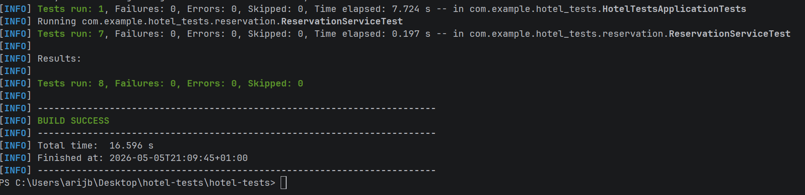
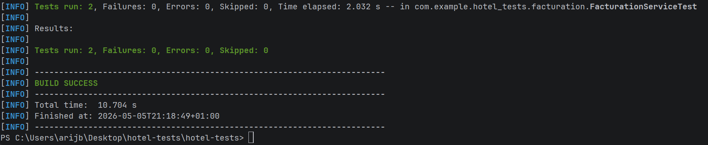
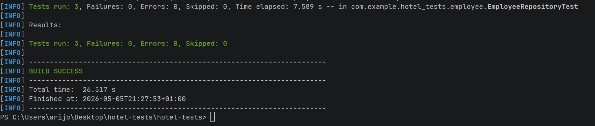
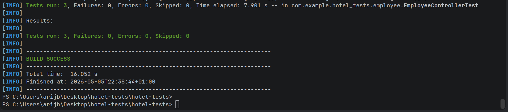
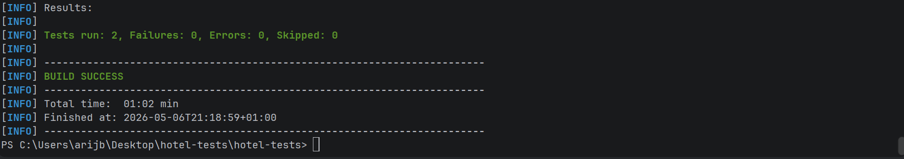
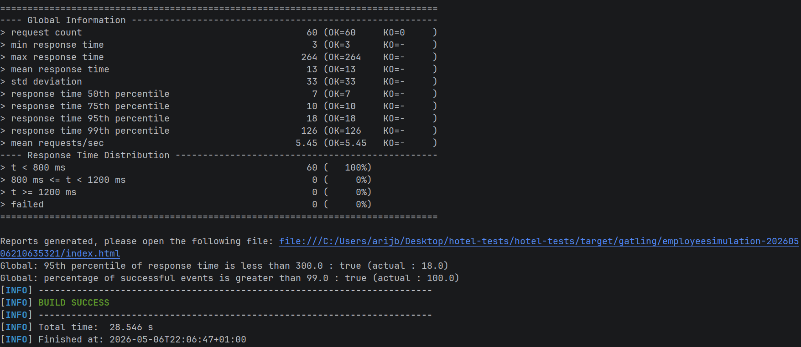
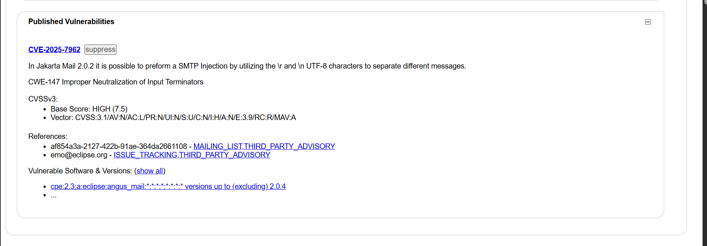
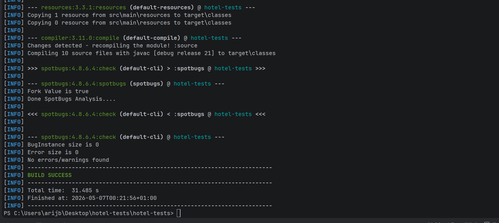
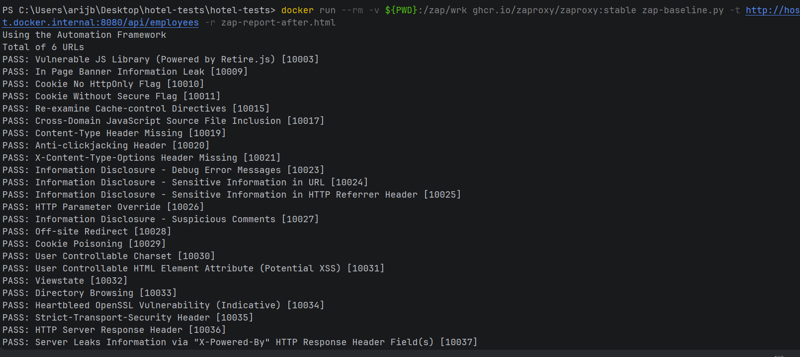

# 🏨 Hotel Tests – Exercices de tests Spring Boot

<p align="center">
  
  
  
  
  
  
</p>

---

# 📌 Description

Ce projet contient la réalisation des **7 exercices de tests** d’une application Spring Boot :

- ✅ Tests unitaires
- ✅ Tests d’intégration
- ✅ Tests REST
- ✅ Tests E2E
- ✅ Tests de performance
- ✅ Analyse de sécurité SAST / DAST

Technologies principales :

- Spring Boot
- JUnit 5
- AssertJ
- Mockito
- H2 Database
- Testcontainers
- PostgreSQL
- Gatling
- OWASP ZAP
- SpotBugs

---

# 📂 Structure du projet

```bash
hotel-tests/
├── .idea/                        
├── .mvn/                          
├── src/
│   ├── main/
│   │   ├── java/
│   │   │   └── com/example/hotel_tests/
│   │   │       ├── demo/         
│   │   │       ├── employee/      
│   │   │       ├── reservation/   
│   │   │       ├── security/      
│   │   │       ├── HotelTestsApplication.java
│   │   │       └── InitData.java  
│   │   └── resources/
│   │       └── application.properties
│   └── test/
│       └── java/
│           └── com/example/hotel_tests/
│               ├── employee/      
│               ├── facturation/  
│               ├── integration/   
│               ├── performance/  
│               ├── reservation/   
│               └── HotelTestsApplicationTests.java
├── target/                        
├── screenshots/                  
├── .gitattributes
├── .gitignore
├── HELP.md
├── mvnw
├── mvnw.cmd
├── pom.xml
├── zap.yaml
├── zap-report.html                
└── zap-report-after.html          
```

---

# 🚀 Exercices réalisés

---

# ✅ Exercice 1 — Tests unitaires avec JUnit 5 & AssertJ

### 🎯 Objectif
Tester la logique métier du service `ReservationService`.

### ✔️ Tests réalisés
- Calcul du prix total
- Séjour court / long
- Vérification des prix négatifs
- Vérification de disponibilité
- Génération du code de confirmation

### 🛠️ Outils
`JUnit 5` • `AssertJ`

### 📸 Capture

<p align="center">
  
</p>

---

# ✅ Exercice 2 — Isolation avec Mockito

### 🎯 Objectif
Tester `FacturationService` en isolant les dépendances.

### ✔️ Tests réalisés
- Mock de `ClientRepository`
- Mock de `NotificationService`
- Vérification des interactions
- Gestion des exceptions

### 🛠️ Outils
`Mockito`

### 📸 Capture

<p align="center">
  
</p>

---

# ✅ Exercice 3 — Tests Repository avec @DataJpaTest

### 🎯 Objectif
Tester les accès aux données avec H2.

### ✔️ Tests réalisés
- Recherche par département
- Recherche par salaire
- Vérification des requêtes personnalisées

### 🛠️ Outils
`@DataJpaTest` • `H2 Database`

### 📸 Capture

<p align="center">
  
</p>

---

# ✅ Exercice 4 — Tests REST avec MockMvc

### 🎯 Objectif
Tester le contrôleur REST `EmployeeController`.

### ✔️ Tests réalisés
- GET Employee
- POST Employee
- Validation des entrées
- Vérification des erreurs 400

### 🛠️ Outils
`@WebMvcTest` • `MockMvc`

### 📸 Capture

<p align="center">
  
</p>

---

# ✅ Exercice 5 — Tests E2E avec Testcontainers

### 🎯 Objectif
Tester l’application avec une vraie base PostgreSQL.

### ✔️ Tests réalisés
- Création d’employé
- Récupération par ID
- Suppression d’employé

### 🛠️ Outils
`Testcontainers` • `PostgreSQL` • `Docker`

### 📸 Capture

<p align="center">
  
</p>

---

# ✅ Exercice 6 — Tests de performance avec Gatling

### 🎯 Objectif
Valider les performances de l’API.

### ✔️ Scénarios réalisés
- Charge normale : 30 utilisateurs
- Stress test : 200 utilisateurs

### ✔️ SLOs respectés
- 95e percentile < 300 ms
- Taux d’erreur < 1 %

### 🛠️ Outils
`Gatling`

### 📸 Capture

<p align="center">
  
</p>

---

# ✅ Exercice 7 — Sécurité SAST & DAST

---

## 🔐 Partie A — OWASP Dependency-Check

### ✔️ Analyse réalisée
Détection des dépendances vulnérables :

- `CVE-2025-7962`
- Score CVSS : 7.5

### 📸 Capture

<p align="center">
  
</p>

---

## 🔐 Partie B — SpotBugs + Find Security Bugs

### ✔️ Vulnérabilités détectées
- `SQL_INJECTION_JPA`
- `HARD_CODE_PASSWORD`

### ✔️ Corrections appliquées
- Paramètres sécurisés
- Suppression des mots de passe codés en dur

### 📸 Capture

<p align="center">
  
</p>

---

## 🔐 Partie C — OWASP ZAP

### ✔️ Analyse dynamique DAST
- Scan avant/après sécurisation
- Réduction des alertes de sécurité
- Ajout des headers HTTP sécurisés

### 📸 Capture

<p align="center">
  
</p>

---

# 🧰 Outils utilisés

| Exercice | Outils |
|----------|---------|
| 1 | JUnit 5, AssertJ |
| 2 | Mockito |
| 3 | @DataJpaTest, H2 |
| 4 | @WebMvcTest, MockMvc |
| 5 | Testcontainers, PostgreSQL |
| 6 | Gatling |
| 7 | OWASP DC, SpotBugs, ZAP |

---

# ▶️ Exécution des tests

## ✅ Tous les tests

```bash
./mvnw test
```

---

## ✅ Test spécifique

```bash
./mvnw test -Dtest=ReservationServiceTest
```

---

## ✅ OWASP Dependency Check

```bash
./mvnw dependency-check:check
```

---

## ✅ SpotBugs

```bash
./mvnw spotbugs:check
```

---

## ✅ Gatling

```bash
./mvnw gatling:test
```

---

## ✅ Scan ZAP via Docker

```bash
docker run --rm -v ${PWD}:/zap/wrk \
ghcr.io/zaproxy/zaproxy:stable \
zap-baseline.py -t http://localhost:8080 -r zap-report.html
```

---

# 👩‍💻 Auteur

### Arij Belaid
Master DevOps Engineering

---
